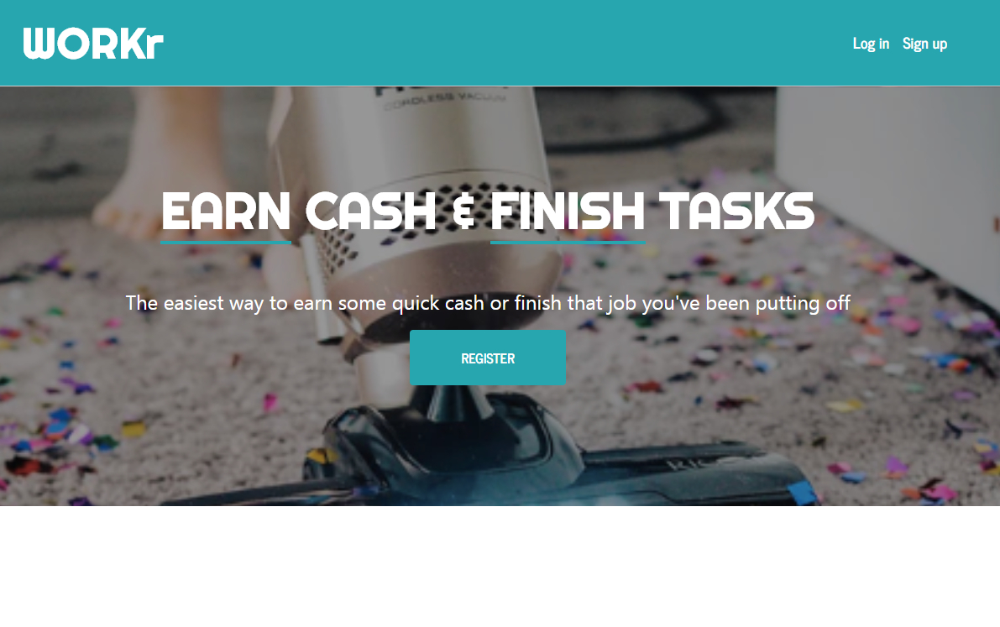
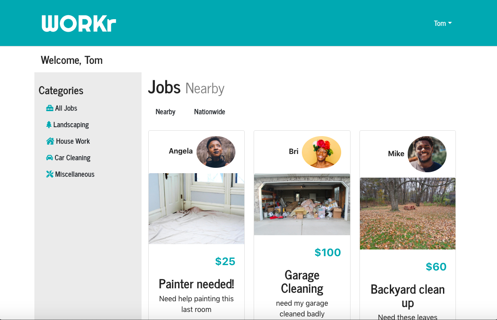

# Workr
## Project 3 Assignment
 

## Goal:
Workr is an application that can be used for any person 18 years old or older to either make fast cash by completing a task that someone is looking to complete or look for someone to get a job done. 

## How it works
Workr allows the user to post or search for active jobs in the area.

1. User comes to landing page where they sign up/log in
2. Upon logging in, they are shown the current jobs that are available based on location
3. In this same page, there is a link where a user can post a job
   - Inside the post a job page, there is aform where user inputs a description, including:
      - Amount to be paid
      - Address
      - Picture of the job
   - After submitting the post, the application adds it to the database and displays it on the user page. 
4. Each job listing has an option to concact seller, where user can text the user posting the job
5. Upon completion of the job, user gets paid
6. Job poster and user doing the job then have the option to rate each other

## Usage
1. On the landing page, create an account by using the 'Sign Up' option 
   - Login if account has already been created
2. After login in the first time, the `Dashboard` should be empty with the legend `Sorry, there are no available jobs in your area` 
   - Dashboard will show available jobs if database is not empty
   - `Dashboard` display explanation:

 

3. Go to your `Name` at the upper right corner, click and select `Post a job`, fill up the form and `Submit`
   - Submit as many jobs as you want
   - You can see the posted jobs by selecting `My jobs` option from the main menu (upper right corner)
4. Go back to the `Dashboard` by selecting this option from the main menu (upper right corner)
5. The `Dashboard` provides a filter under `Categories`. 
   - User can filter available jobs by the listed categories:
      * Landscaping
      * House Work
      * Car Cleaning
      * Miscellaneous 
6. Logout by selecting this option from the main menu at the upper right corner.

## Technologies used for the project

- [x] Google Maps React - Get user location information to filter jobs based on location
- [x] Passport.js - user validation. Middleware used to authenticate requests in node applications
- [x] Express - Framework for Node.js that will listen on the server side for input request from clientes
- [x] MongoDb - Database to store jobs, messages, user information (GET & POST)
- [x] Firebase - Store images
- [x] REACT Bootstrap & FontAwesome - front end design
- [x] jQuery - Javascript front-end manipulation
- [x] Zip codes npm - for location radius
- [x] LocationIQ - for reverse geocoding
- [x] Axios for attaining (get) json from LocationIQ api
- [x] Moment-React - Formatting the date that is in the database
- [x] React-confirm-alert: Present confirmation dialog to the user
- [x] UUID - to generate random id's for storing images in firebase

### View the app here
https://tranquil-journey-10841.herokuapp.com/

If you want to login without having to sign up then use these credentials
email: tester1@gmail.com
password: password